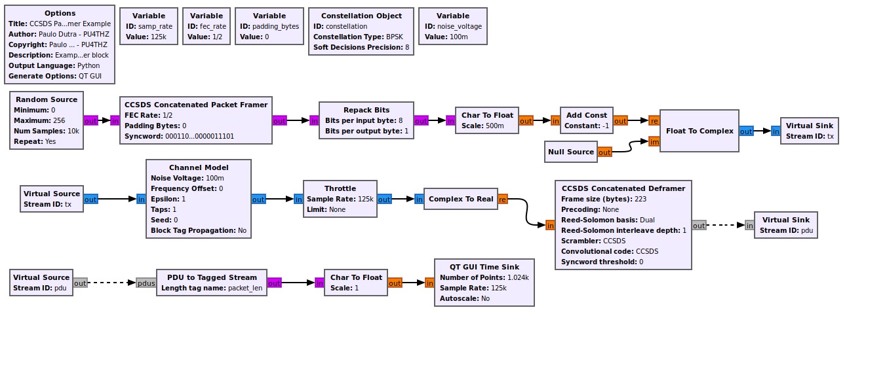
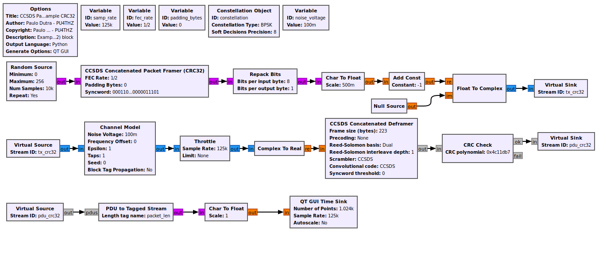

# CCSDS-Packet-Framer

A CCSDS Concatenated Framer block for GNU Radio.

This block implements implements some of the CCSDS protocols defined in the TM Synchronization and Channel Coding Blue Book (checkout [CCSDS Blue Books](https://public.ccsds.org/Publications/BlueBooks.aspx)) following the encoding chain:
- Fixed Length Framing (Up to 223 bytes, 219 with CRC32)
- (Optional) CRC32 Insertion
- Reed-Solomon encoding (RS(255,223))
- CCSDS scrambler
- CCSDS 32-bit syncword insertion
- Convolutional encoding (1/2 rate, constraint length 7)
- Puncturing for various rates.

## 🔧 Dependencies

This block **requires**:
- [GnuRadio > 3.10](https://www.gnuradio.org), older versions might work with changes.
- [gr-satellites](https://github.com/daniestevez/gr-satellites), which provides a compatible CCSDS Concatenated Deframer for use in receive (RX) chains.

## 🧱 Processing Flow

Default:
```
Bytes → Framing(Fixed size, 223-Padding Bytes) → RS(223,255) → Scrambler(CCSDS) → Syncword(CCSDS: 0x1ACFFC1D) → Convolutional Encoder (R=1/2, K=7) → Puncturing (Rate) -> Bytes
```

CRC32:
```
Bytes → Framing(Fixed size, 219-Padding Bytes) → CRC32(0x4C11DB7) → RS(223,255) → Scrambler(CCSDS) → Syncword(CCSDS: 0x1ACFFC1D) → Convolutional Encoder (R=1/2, K=7) → Puncturing (Rate) -> Bytes
```

## 📦 Available FEC Rates

The block supports standard convolutional code puncturing patterns:

|  Rate  |  Puncturing Pattern    |
|--------|------------------------|
| "1/2"  | `11`                   |
| "2/3"  | `1101`                 |
| "3/4"  | `110110`               |
| "5/6"  | `1101100110`           |
| "7/8"  | `11010101100110`       |

## CRC32 Parameters:
```
CRC size (bits): 32
CRC polynomial: 0x4C11DB7
Initial register value: 0xFFFFFFFF
Final XOR value: 0xFFFFFFFF
LSB-first input: False
LSB-first result: False
LSB CRC in PDU: False
Header bytes to skip: 0
```
## 🚀 Example Usage & Flowgraphs

Use this block in a GNU Radio flowgraph to generate CCSDS-compatible transmit frames.

- For **TX chains**, use this framer. 
- For **RX chains**, use the [**CCSDS Concatenated Deframer**](https://gr-satellites.readthedocs.io/en/latest/components.html#ccsds-deframers) from `gr-satellites`. 

#### BPSK Example

This example shows a Binary Phase Shift Keying (BPSK) Modulator & Demodulator using the CCSDS Concatenated Code (RS(255,223) + CC(R=1/2, K=7)) with Scrambling, it sends random data packets of 223 bytes size, and plots the received bytes on time domain.


File: [example.grc](examples/example.grc)

#### BPSK Example (CRC32)

This example shows a Binary Phase Shift Keying (BPSK) Modulator & Demodulator using the CCSDS Concatenated Code (RS(255,223) + CC(R=1/2, K=7)) with Scrambling and CRC32, it sends random data packets of 219 bytes size, and plots the received bytes on time domain.


File: [example_crc32.grc](examples/example_crc32.grc)

## 📄 License

*This project is licensed under the MIT License - see the [LICENSE](LICENSE) file for details.*